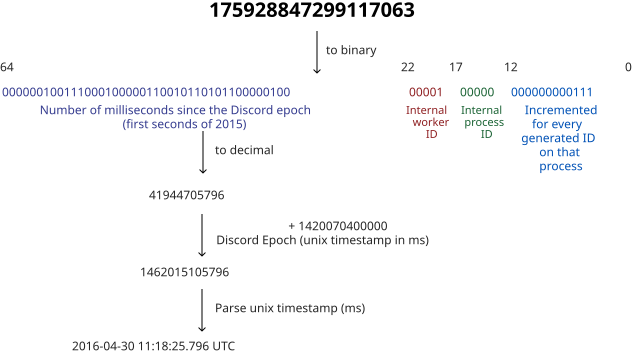

# API Reference

> A Rigel API is a REST API that allows you to interact with the instance data from your own applications. It's the primary way to interact with an instance from your own code.

### Base URL

```sh
https://server.rigel.chat/api
```

## API Versioning

> [!CAUTION]
> Some API and Gateway versions are now non-functioning, and are labeled as discontinued in the table below for posterity. Trying to use these versions will fail and return 400 Bad Request.

A Rigel instance exposes different versions of API. You should specify which version to use by including it in the request path like https://server.rigel.chat/api/v{version_number}. Omitting the version number from the route will route requests to the current default version (marked below). You can find the change log for the newest API version here.

### API Versions

| Version | Status      | Default |
| ------- | ----------- | ------- |
| 0       | Development | ✅      |

## Error Messages

## Authentication

## Snowflake

A Rigel instance utilizes Twitter's [snowflake](https://github.com/twitter-archive/snowflake/tree/snowflake-2010) format for uniquely identifiable descriptors (IDs). These IDs are guaranteed to be unique across all of the instance, except in some unique scenarios in which child objects share their parent's ID. Because Snowflake IDs are up to 64 bits in size (e.g. a uint64), they are always returned as strings in the HTTP API to prevent integer overflows in some languages.

### Convert Snowflake to DateTime



### Snowflake ID Broken Down in Binary

```
111111111111111111111111111111111111111111 11111 11111 111111111111
64                                         22    17    12          0
```

### Snowflake ID Format Structure (Left to Right)

| Field               | Bits     | Number of bits | Description                                                                  | Retrieval                           |
|---------------------|----------|----------------|------------------------------------------------------------------------------|-------------------------------------|
| Timestamp           | 63 to 22 | 42 bits        | Milliseconds since Discord Epoch, the first second of 2015 or 1420070400000. | `(snowflake >> 22) + 1420070400000` |
| Internal worker ID  | 21 to 17 | 5 bits         |                                                                              | `(snowflake & 0x3E0000) >> 17`      |
| Internal process ID | 16 to 12 | 5 bits         |                                                                              | `(snowflake & 0x1F000) >> 12`       |
| Increment           | 11 to 0  | 12 bits        | For every ID that is generated on that process, this number is incremented   | `snowflake & 0xFFF`                 |

#### Generating a snowflake ID from a Timestamp Example

```sh
(timestamp_ms - DISCORD_EPOCH) << 22
```

## ID Serialization

## ISO8601 Date/Time (todo: rigel just use bigint ms timestamp)

## HTTP API

### User Agent

### Content Type

### Rate Limiting

### Boolean Query Strings

### Array Query Strings

## Gateway (WebSocket) API

## Message Formatting

Rigel utilizes a subset of markdown for rendering message content on its clients, while also adding some custom functionality to enable things like mentioning users and channels. This functionality uses the following formats:

### Formats

| Type                  | Structure             | Example                        |
| --------------------- | --------------------- | ------------------------------ |
| User                  | `<@USER_ID>`          | `<@80351110224678912>`         |
| Channel               | `<#CHANNEL_ID>`       | `<#103735883630395392>`        |
| Role                  | `<@&ROLE_ID>`         | `<@&165511591545143296>`       |
| Standard emoji        | Unicode characters    | 🪴                             |
| Custom emoji          | `<:NAME:ID>`          | `<:mmLol:216154654256398347>`  |
| Animated custom emoji | `<a:NAME:ID>`         | `<a:b1nzy:392938283556143104>` |
| Unix timestamp        | `<t:TIMESTAMP>`       | `<t:1618953630>`               |
| Styled unix timestamp | `<t:TIMESTAMP:STYLE>` | `<t:1618953630:d>`             |

Using the markdown for users or roles will mention the target(s), and notify them depending on the sender's permissions as well as the value of the `allowed_mentions` field when creating a message. Standard emoji are currently rendered using [Twemoji](https://github.com/jdecked/twemoji).

Timestamps are expressed in **seconds** and display the given timestamp in the user's timezone and locale.

### Timestamp Styles

| Style         | Example Output                   | Description             |
| ------------- | -------------------------------- | ----------------------- |
| t             | 16:20                            | Short Time              |
| T             | 16:20:30                         | Medium Time             |
| d             | 20/04/2021                       | Short Date              |
| D             | April 20, 2021                   | Long Date               |
| f *(default)* | April 20, 2021 at 16:20          | Long Date, Short Time   |
| F             | Tuesday, April 20, 2021 at 16:20 | Full Date, Short Time   |
| s             | 20/04/2021, 16:20                | Short Date, Short Time  |
| S             | 20/04/2021, 16:20:30             | Short Date, Medium Time |
| R             | 4 years ago                      | Relative Time           |

## Image Formatting

> [!NOTE]
> Animated images uploaded as WebP or AVIF do not convert cleanly to GIF. Apps should request animated images as WebP for maximum compatibility, as this works regardless of the original upload format.

## Image Data

### Signed Attachment CDN URLs

## Uploading Files

### Editing Message Attachments

## Locales

| Locale | Language Name | Native Name |
| ------ | ------------- | ----------- |
| en-US  | 	English, US  | English, US |